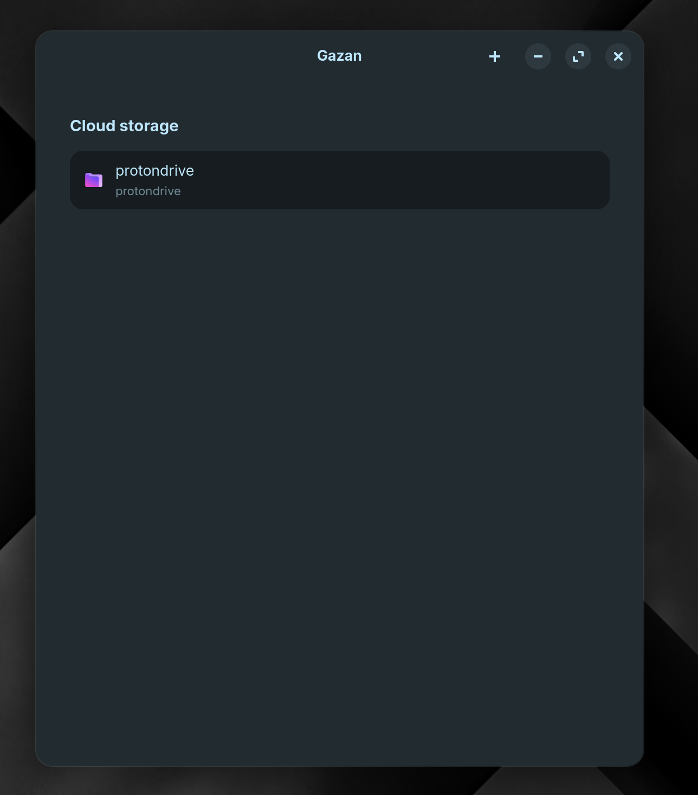
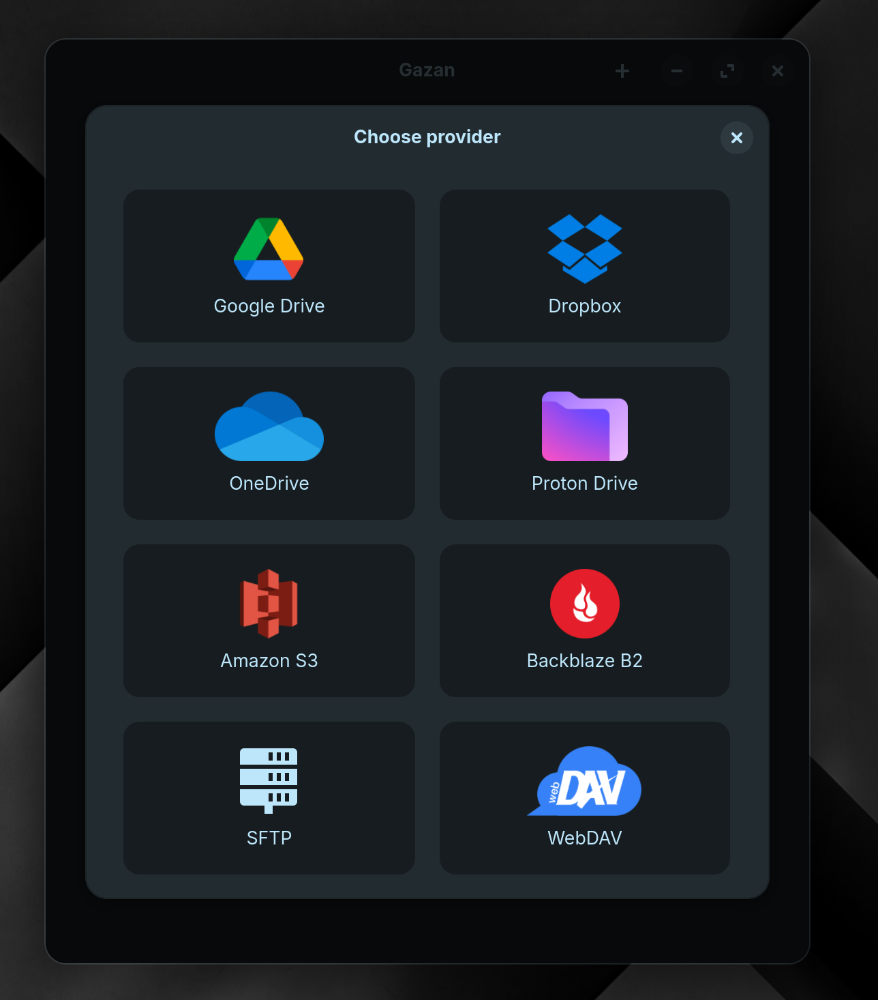

# Gazan

A graphical frontend for [rclone](https://rclone.org/) built with GTK 4 and libadwaita. Gazan lets you manage your cloud storage connections through a clean, native GNOME-style interface — no terminal required for supported providers.

## Preview

<p align="center">
  
  
</p>

## Features

- View all configured rclone remotes at a glance
- Add new cloud storage connections through a guided dialog
- Provider logos and a polished libadwaita UI that fits right in on GNOME

### Supported providers

| Provider | Auth method |
|---|---|
| Google Drive | OAuth (via `rclone config`) |
| Dropbox | OAuth (via `rclone config`) |
| Microsoft OneDrive | OAuth (via `rclone config`) |
| Proton Drive | Email & password |
| Amazon S3 | Access key (AWS, Wasabi, or S3-compatible) |
| Backblaze B2 | Key ID & application key |
| SFTP | Host, username & password |
| WebDAV | URL, server type & credentials |

> **Note:** OAuth providers (Google Drive, Dropbox, OneDrive) require browser sign-in, which isn't yet handled inside Gazan. Run `rclone config` once in a terminal to set those up — they'll appear in Gazan automatically after that.

## Requirements

- Python 3.10+
- [rclone](https://rclone.org/install/) installed and available on `PATH`
- GTK 4 and libadwaita — installed via your distro's package manager:

| Distro | Command |
|---|---|
| Arch / Artix | `sudo pacman -S gtk4 libadwaita` |
| Debian / Ubuntu | `sudo apt install gir1.2-gtk-4.0 gir1.2-adw-1` |
| Fedora | `sudo dnf install gtk4 libadwaita` |

## Installation

```bash
git clone https://codeberg.org/subhangadirli/gazan.git
cd gazan
python -m venv venv
source venv/bin/activate
pip install -e .
```

## Running

```bash
gazan
# or
python -m gazan
```

## Project structure

```
gazan/                       ← repo root
├── gazan/                   ← Python package
│   ├── application.py       # GApplication subclass and entry point
│   ├── ui/
│   │   ├── window.py        # Main application window
│   │   ├── remotes_page.py  # Remotes list view
│   │   ├── add_remote_dialog.py # Multi-step dialog for adding a remote
│   │   └── icons.py         # Icon loading helpers
│   ├── backend/
│   │   ├── providers.py     # Provider definitions and field schemas
│   │   └── rclone.py        # rclone subprocess wrapper
│   └── assets/
│       ├── gazan-logos/     # Application icons
│       └── provider-logos/  # Per-provider icons
└── pyproject.toml

```

## License

Gazan is free software released under the [GNU General Public License v3](LICENSE).
